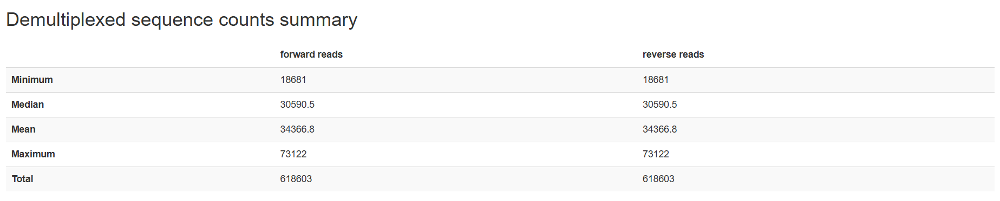
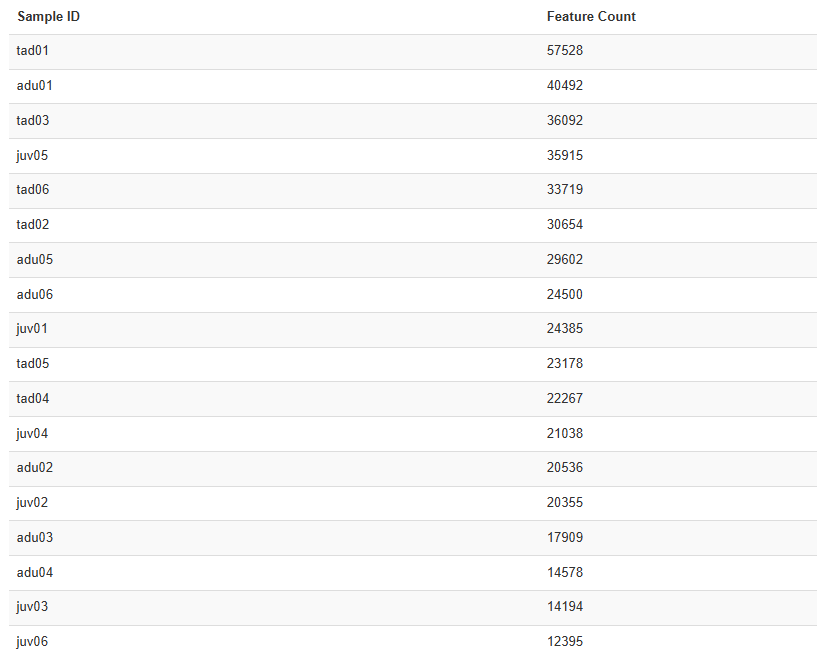
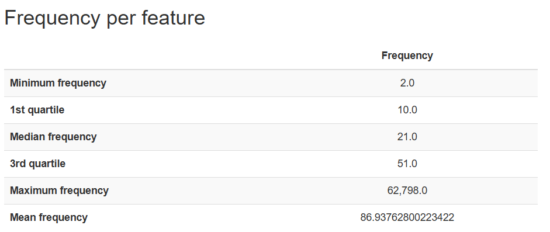
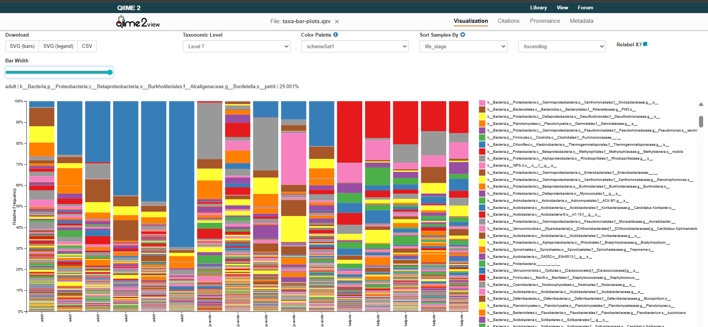
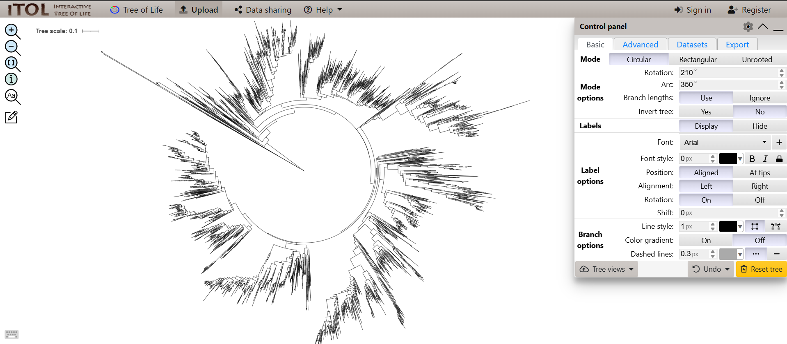
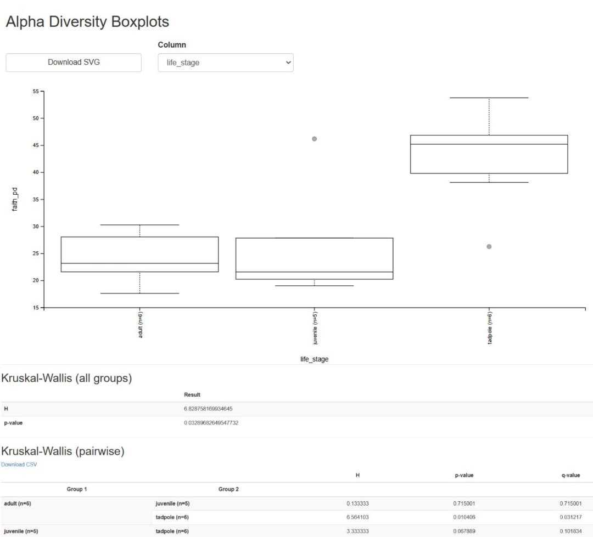
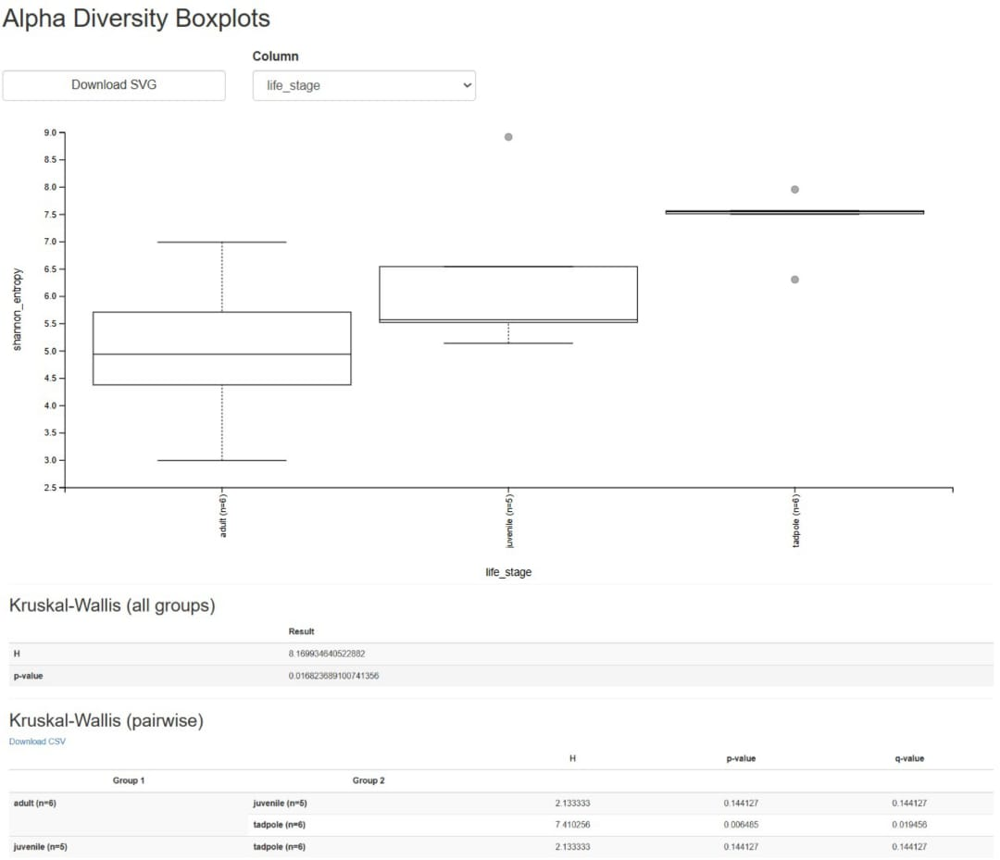
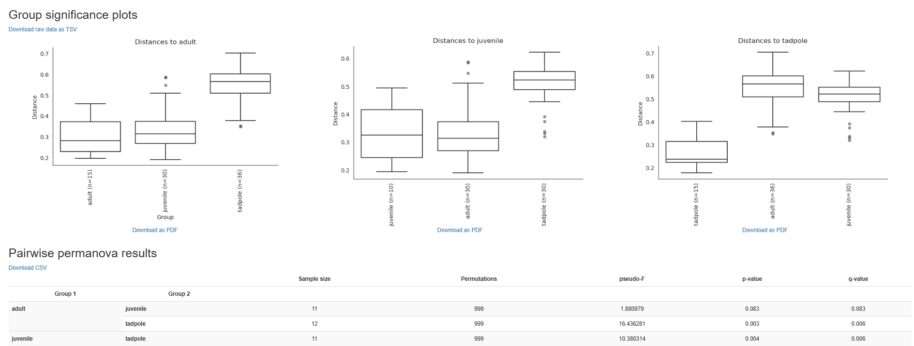
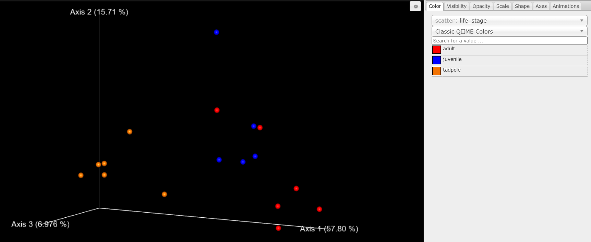

## Installing QIIME2 in Conda environment
```
wget https://data.qiime2.org/distro/core/qiime2-2020.2-py36-linux-conda.yml
conda env create -n qiime2-2020.2 --file qiime2-2020.2-py36-linux-conda.yml
# OPTIONAL CLEANUP
rm qiime2-2020.2-py36-linux-conda.yml
```

## Prequiste folders for command execution

These directories can be created using script file from the repo (directory.sh), or manually running the code one by one.

```
mkdir demultiplexed_data
mkdir denoised_data
mkdir filtered_seqs
mkdir taxonomy
mkdir phylogeny
```

## Data Import 

Data for the analysis can be downloaded by simply downloading frog-paired-end-sequences and sample-metadata.tsv.

For understanding basic terminologies refer to moving picture tutorial or start by reading begining metagenomics.

## Demulitplexing the downloaded data

```
qiime tools import \
--type 'SampleData[PairedEndSequencesWithQuality]' \
--input-path frog-paired-end-sequences \
--input-format CasavaOneEightSingleLanePerSampleDirFmt \
--output-path demultiplexed_data/demux-paired-end.qza
```

## Visualising the demultiplexed data

```
qiime demux summarize \
--i-data demultiplexed_data/demux-paired-end.qza \
--o-visualization demultiplexed_data/demux-paired-end.qzv
```



## Denoising using DADA2

```
qiime dada2 denoise-paired \
--i-demultiplexed-seqs demultiplexed_data/demux-paired-end.qza \
--p-trunc-len-f 200 \
--p-trim-left-f 23 \
--p-trunc-len-r 200 \
--p-trim-left-r 20 \
--o-representative-sequences denoised_data/rep-seqs.qza \
--o-table denoised_data/table.qza \
--o-denoising-stats denoised_data/stats.qza
```

## Feature Table and Feature Data summaries

```
qiime feature-table summarize \
--i-table denoised_data/table.qza \
--o-visualization denoised_data/table.qzv \
--m-sample-metadata-file sample-metadata.tsv

qiime feature-table tabulate-seqs \
--i-data denoised_data/rep-seqs.qza \
--o-visualization denoised_data/rep-seqs.qzv
```



## Filtering DADA2 by sampling depth

From the above table we take the sampling depth of 14000 to be more approriate for further analysis.

```
qiime feature-table filter-samples \
--i-table denoised_data/table.qza \
--p-min-frequency 14000 \
--o-filtered-table filtered_seqs/filtered-table.qza
```

Summarising the above artifact can see the applied filtering and removal of juv06.

```
qiime feature-table summarize \
--i-table filtered_seqs/filtered-table.qza \
--o-visualization filtered_seqs/filtered-table.qzv \
--m-sample-metadata-file sample-metadata.tsv
```

## Filtering features with low abundance

Filtering features with low frequencies from the data. Minimum frequency is considered to be 10 by taking into consideration from frequency of feature table.

```
qiime feature-table filter-features \
--i-table filtered_seqs/filtered-table.qza \
--p-min-frequency 10 \
--o-filtered-table filtered_seqs/feature-frequency-filtered-table.qza
```



## Taxonomy Assignment

Using a pre-trained classifier to perform taxonomic classification.

```
wget https://data.qiime2.org/2021.2/common/gg-13-8-99-515-806-nb-classifier.qza


qiime feature-classifier classify-sklearn \
--i-classifier gg-13-8-99-515-806-nb-classifier.qza \
--i-reads denoised_data/rep-seqs.qza \
--o-classification taxonomy/taxonomy.qza
```

## Filtering for Bacteria

In this experiment bacterias are only considered, so we exculde all unrelated phylums and kingdoms in analysis. You can run all steps in one go using a script file (filtering-bacterial-table-seqs-files.sh).

```
qiime taxa filter-table \
  --i-table filtered_seqs/feature-frequency-filtered-table.qza \
  --i-taxonomy taxonomy/taxonomy.qza \
  --p-include p__ \
  --p-exclude mitochondria,chloroplast \
  --o-filtered-table filtered_seqs/table-no-mitochondria-chloroplast.qza

qiime taxa filter-table \
  --i-table filtered_seqs/table-no-mitochondria-chloroplast.qza \
  --i-taxonomy taxonomy/taxonomy.qza \
  --p-exclude "k__Archaea" \
  --o-filtered-table filtered_seqs/table-no-mitochondria-chloroplast-archaea.qza

qiime taxa filter-table \
  --i-table filtered_seqs/table-no-mitochondria-chloroplast-archaea.qza \
  --i-taxonomy taxonomy/taxonomy.qza \
  --p-exclude "k__Eukaryota" \
  --o-filtered-table filtered_seqs/filtered-table.qza

qiime taxa filter-seqs \
  --i-sequences denoised_data/rep-seqs.qza \
  --i-taxonomy taxonomy/taxonomy.qza \
  --p-include p__ \
  --p-exclude mitochondria,chloroplast \
  --o-filtered-sequences filtered_seqs/rep-seqs-no-mitochondria-chloroplast.qza

qiime taxa filter-seqs \
  --i-sequences filtered_seqs/rep-seqs-no-mitochondria-chloroplast.qza \
  --i-taxonomy taxonomy/taxonomy.qza \
  --p-exclude "k__Archaea" \
  --o-filtered-sequences filtered_seqs/rep-seqs-no-mitochondria-chloroplast-archaea.qza

qiime taxa filter-seqs \
  --i-sequences filtered_seqs/rep-seqs-no-mitochondria-chloroplast-archaea.qza \
  --i-taxonomy taxonomy/taxonomy.qza \
  --p-exclude "k__Eukaryota" \
  --o-filtered-sequences filtered_seqs/filtered-rep-seqs.qza
```
## Visualizing Taxonomic Classification

From the given plot we can sort by abundance of particular set of organisms to find the significance of organism in the experiment.

```
qiime taxa barplot \
--i-table filtered_seqs/table-no-mitochondria-chloroplast-archaea.qza \
--i-taxonomy taxonomy/taxonomy.qza \
--m-metadata-file sample-metadata.tsv \
--o-visualization taxonomy/taxa-bar-plots.qzv
```



## Phylogenetic Analysis

We use filtered bacteia sequences in making the phylogenetic tree, only to draw relation between bacterias in the surface of the skin.

```
qiime phylogeny align-to-tree-mafft-fasttree \
--i-sequences filtered_seqs/rep-seqs-no-mitochondria-chloroplast-archaea.qza \
--o-alignment phylogeny/aligned-rep-seqs.qza \
--o-masked-alignment phylogeny/masked-aligned-rep-seqs.qza \
--o-tree phylogeny/unrooted-tree.qza \
--o-rooted-tree phylogeny/rooted-tree.qza
```

Exporting tree for visualisation in iTOL.

```
qiime tools export \
  --input-path phylogeny/rooted-tree.qza \
  --output-path exported-tree
```


## Diversity Analysis

We start by exploring the filtered table with only bacteria sequences.

```
qiime feature-table summarize \
--i-table filtered_seqs/table-no-mitochondria-chloroplast-archaea.qza \
--o-visualization filtered_seqs/table-no-mitochondria-chloroplast-archaea.qzv \
--m-sample-metadata-file sample-metadata.tsv
```

Generating diversity metrics for alpha and beta diversity. Sampling depth is taken based on the smallest read sample in this case it is 13108.

```
qiime diversity core-metrics-phylogenetic \
--i-phylogeny phylogeny/rooted-tree.qza \
--i-table filtered_seqs/table-no-mitochondria-chloroplast-archaea.qza \
--p-sampling-depth 13108 \
--m-metadata-file sample-metadata.tsv \
--output-dir diversity-metrics-results
```

## Alpha Diversity analysis

Alpha diversity helps in gaining perspective of abundance of microbes in each sample. Alpha diversity commonly uses faith and shannon phylogenetic diversity metrics, with help of kruskal-wallis test we confirm the result from each metrics. 

```
qiime diversity alpha-group-significance \
--i-alpha-diversity diversity-metrics-results/faith_pd_vector.qza \
--m-metadata-file sample-metadata.tsv \
--o-visualization diversity-metrics-results/faith-pd-group-significance.qzv

qiime diversity alpha-group-significance \
--i-alpha-diversity diversity-metrics-results/shannon_vector.qza \
--m-metadata-file sample-metadata.tsv \
--o-visualization diversity-metrics-results/shannon-group-significance.qzv
```





From Kruskal Wallis test results and box plot interpretation from faithpd and shannonpd index, we can see more diversity difference between adult and tadpole (confirmed by H, p and q-value).

## Beta Diversity

Beta diversity measures how different are microbial community between the samples. Commonly used metrics are 

- Jaccard Index - checks presence/absences
- Bray-Curtis dissimilarity - checks relative abundance (how similar/different)
- Unweighted UniFrac -uses phylogenetic tree + presence/absence of microbes from the branch
- Weighted UniFrac - uses phylogenetic tree + abundance from the tree

We use Premanova on Weighted UniFrac to find their statistical significance.

```
qiime diversity beta-group-significance \
--i-distance-matrix diversity-metrics-results/weighted_unifrac_distance_matrix.qza \
--m-metadata-file sample-metadata.tsv \
--m-metadata-column life_stage \
--o-visualization diversity-metrics-results/weighted-unifrac-life-stage-significance.qzv \
--p-pairwise
```



From premanova results we can see how tadpole and juvenile/adult are significantly disimilar to each other. Below you can find the pcoa visualisation of Weighted UniFrac metric which can replicated from weighted_unifrac_emperor.qzv.


